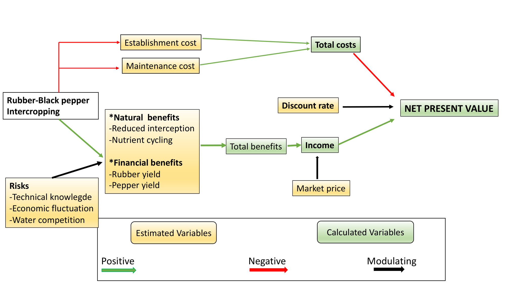

```{r setup, include=FALSE}
knitr::opts_chunk$set(echo = TRUE)
library(knitr)
library(decisionSupport)
library(readr)
```


```{r, add_packages_bib, include=FALSE}
knitr::write_bib(c(.packages(),
                   'decisionSupport'), 'bib/packages.bib')

```


# **Overview**

Rubber plant ( _Hevea brasiliensis_) is a perennial crop and the natural source of rubber which is used in the production of a variety of products [@fox2013; @pandey2020]. Natural rubber farming is a safe and affordable alternative to synthetic rubber production. 

In recent decades, Nepal has experienced a huge trade deficit between the import and export of rubber and rubber-related products, and at the same time, their consumption exceeds production [@pandey2020; @cifor2022]. Furthermore, as rubber plants start yielding from six to seven years after planting [@pandey2020]  and, onwards, there is a need to diversify the system to enable farmers to generate income before rubber attains its maturity stage.  

Black pepper ( _Piper nigrum L._) is a valuable crop which could be suitable for this agronomic intervention but could also improve farmers livelihoods and lower their dependency on the international market/price fluctuation of rubber [@pandey2020]. 


Intercropping black pepper and rubber capitalizes on their complementary growth patterns and could potentially improve the ecological and financial advantages of rubber farming. Black pepper, a vine-like plant, thrives in the shade provided by the rubber trees. The the vertical space is used more efficiently and weed competition potentially reduces within the plantation. Rubber trees, on the other hand, might benefit from the protection provided by the pepper vines which act as a natural windbreak and provide a microclimate conducive to rubber growth [@oliosi2021].

Nepal, being a country known for its diverse agro-climatic conditions [@oliosi2021] , offers a favorable environment for intercropping rubber with black pepper. We assume it as a system that could maximize productivity and economic returns if planted in a well-planned agroforestry system.

## Current Situation of Rubber Production in Nepal
Nepal's climate and land slope make natural rubber cultivation ideal for addressing issues such as underemployment, underutilization of land, and poverty. However, rubber monocropping poses several challenges for farmers, including a lack of income during the long immature period, vulnerability to price shocks, seasonality, disease outbreaks, and natural disaster (DERAF report, 2020). There is a high level of rubber and pepper imports because of tight supply conditions in Nepal [@pandey2020]. To overcome these obstacles there is a need to promoting rubber agroforestry practices especially with compatible and mutual beneficial crop species. 

## Why Rubber and Black Pepper Agroforestry system?
Integrating black pepper and Rubber in an agroforestry system can offer a solution to improve food security, increase farmers' income, and enhance their livelihoods [@rahman2012]. Intercropping rubber with black pepper enables smallholders to diversify their income sources and optimize land utilization during the initial six years it takes for rubber trees to become productive [@oliosi2021]. Additionally, shading black pepper with rubber trees creates favorable growth conditions, including decreased irradiance and temperature, increased relative humidity, and higher leaf expansion, demonstrating adaptation to low light [@oliosi2021].

## Decision Problem
To improve their income and livelihoods, farmers in Nepal might want to adopt rubber agroforestry practices, specifically intercropping black pepper with rubber, as an alternative to rubber monocropping. Farmers' decisions are influenced by factors such as:


__1. Economic Impact:__ This assesses the potential income generation and economic viability of rubber intercropping practices compared to rubber monocropping, considering factors such as yield, market demand, price stability, and income diversification opportunities. 

__2. Risk and Resilience:__ focuses on assessing the vulnerability of rubber intercropping systems to price shocks, disease outbreaks, natural disasters, and other risks, while identifying strategies to mitigate them. 


__3. Policy and Market Support:__ Involves the evaluation of existing policies, incentives, and market linkages to facilitate the adoption of rubber intercropping systems, addressing any barriers and gaps. 


__4. Cost-Benefit Analysis:__ This focuses on a comprehensive cost-benefit analysis, comparing the economic, environmental, and social benefits of rubber intercropping systems with rubber monocropping.


__5. Technical knowledge and support:__ This considers whether farmers have access to technical knowledge and support. This includes understanding the agronomic practices, pest and disease management, harvesting, processing, and marketing strategies for both crops. Training programs, extension services, and collaboration with agricultural experts can help address these knowledge gaps.

## Decision

**Should farmers intercrop their Rubber monocultures with black pepper?**

## Alternatives

__1. Baseline:__ Promote Rubber monocropping 
__2. Alternative:__  Promote Rubber and Black Pepper intercropping

## Decision Maker
The decision makers for this project are the smallholder rubber farmers in Jhapa, Nepal. The ultimate goal is to improve their income and livelihoods.

# **Methods**

## Conceptual model
A conceptual model depicting the influence of rubber and black pepper intercropping system costs, benefits and risks on Net Present value (NPV) was developed by the project group members who acted as the stakeholders \@ref(fig:cenceptual_model). The total cost comprised of establishment cost and maintenance cost, while total benefits comprised of natural and financial benefits. Lack of technical knowledge, water competition and economic fluctuation were the major risks identified. Economic fluctuation was however considered as a high variating variable in the price. A discount rate of 10 % was chosen to calculate the Net Present Value.This conceptual model guided the development of the mathematical model. 

```{r conceptual_model, out.width='100%', fig.align='center', fig.cap="Conceptual Model", echo=FALSE}



```

## Input estimates
Project group members who were calibrated in the decision analysis course were the experts. We used similar scenario from a literature search and some exchange with farmers in Nepal to generated input estimates with 90% confidence.


```{r input_table, caption= "Table of input variables used in the model.", echo=F, warning=FALSE}
library(knitr)
options(scipen = 999)

input_estimates <- read.csv("./data/AF_input_table.csv", header = TRUE, sep = ";")
input_estimates <- subset(input_estimates, select = -c(median, label))
knitr::kable(input_estimates)

``` 

## Assumptions

Since Black Pepper grows best within moist climate, its cultivation usually requires irrigation [@fao2023]. The climate of Eastern Nepal is marked by the annual Monsoon and long dry seasons during winter [@worldbank2021]. Thereby, especially the winter months are crucial to achieve high yields, and Pepper plants consequently would need to be irrigated.  
We assumed two scenarios concerning water regime in our agroforestry system: That on the first hand, black pepper grown next to rubber trees could mitigate irrigation requirements as the rubber's shadow would increase the moisture. Such a benefitial microclimate was documented in Brazilian pepper-rubber-agroforestry-systems [@oliosi2021]. Is has to be noted that this system consisted of alternating rows of rubber and pepper. 
Planted planted directly next to each other, the water competition might be higher. This is why we assumed that, on the other hand, intercroppping might amplify irrigation requirements as the roots in the topsoil could compete for water and both crops would produce smaller harvests.


Additionally, it is reported that litterfall releases high amounts of primary macronutrients such as Nitrogen, Phosphorous, and potassium (NPK) back into the soil. Estimating how much each system recycles will help to determine the profitability and sustainability of the studied systems in regard to nutrient cycling and minimize fertilization inputs in the following cropping systems.

## Code
We used the *decisionSupport* package [@R-decisionSupport] to build the mathematical model and for probabilistic analysis.

### Variating variables
Variables that shall variate with every annual step were calculated with using the```decisionSupport::vv()``` function. Consequently, the variation accorded to our estimated ranges and underlying distributions (see \tab:input_table). 

### Chance events
Our two water regime scenarios were modelled using the ```decisionSupport::chance_event()```function. A chance of 10-30 % was assumed that water competition would occur, leading to lower yields and higher irrigation costs.


### Model function which will be used to run the Monte Carlo simulation

```{r, echo=T, warning=F}
library(decisionSupport)

# Read data----
table <- read.csv("./data/AF_input_table.csv", sep = ";")

# Make variable to check what each code generates and if it works

make_variables <- function(est,n=1) { 
   x <- random(rho=est, n=n)
    for (i in colnames(x)) assign(i,as.numeric(x[1,i]), envir=.GlobalEnv)
  }

make_variables(as.estimate(table))


# Model function----

system_benefit <- function(x, varnames) {

## Natural benefits ----
 ### Nutrient cycling (from litterfall)

mono_nutrient <- vv(var_mean = mono_nutrient,
                            var_CV = Var_Cv,
                            n = n_years) 

mono_nutrient_saved <- mono_nutrient* fertilizer_price  #Monetary value of NPK fertilizer bags saved in rubber monoculture

AF_nutrient <- vv(var_mean = AF_nutrient,
                            var_CV = Var_Cv,
                            n = n_years)

AF_nutrient_saved <- AF_nutrient * fertilizer_price  #Monetary value of NPK fertilizer bags saved in rubber and pepper system  


## Yields----
 ## Scenarios
  ### As it is not known yet, the moist microclimate underneath the rubber trees can result in higher 
  ### pepper yields or, on the other hand, competition of the roots might lead to lower yields of both crops
  water_competition <- chance_event(water_competition_probability, value_if = 1, value_if_not = 0)
  
  ### Account for risk in diminished yields due to knowledge gaps especially at the initial phase
  ### and risk of knowledge gaps that could also lead to lower yields
  management_errors <- vv(var_mean = knowledge_gap_probability, var_CV = Var_Cv,
                          n = n_years, relative_trend = - 10)
  
  ## Yield incomes
  rubber_yield <- vv(var_mean = max_rubber_yield, var_CV = Var_Cv, n = n_years)
rubber_income <- rubber_yield * (1 - management_errors) * (1 - water_competition * yield_if_competition) * rubber_price
    
  pepper_yield <- vv(var_mean = max_pepper_yield, var_CV = Var_Cv, n = n_years)
  pepper_income <- pepper_yield * (1 - management_errors) * (1 - water_competition * yield_if_competition) * pepper_price
  

## Summarize benefits
  rubber_benefit <- rubber_income + mono_nutrient_saved
  AF_benefit <- pepper_income + rubber_income + AF_nutrient_saved
  

## Costs----
  ### Establishment costs in first year
  establistment_cost_mono <- c(establishment_cost_mono, rep(0, n_years - 1))
  establistment_cost_AF <- c(establishment_cost_AF, rep(0, n_years - 1))
  
  maintenance_cost_mono <- vv(var_mean = rubber_main_cost, var_CV = Var_Cv,
                              n = n_years)
  maintenance_cost_pepper <- vv(var_mean = pepper_main_cost, var_CV = Var_Cv,
                              n = n_years)
  
  
  ### Water costs
  ### pepper needs to be irrigated which is an addition cost.
  price_water <- vv(cost_water, Var_Cv, n_years)
  
  if (water_competition) {
    AF_water <- vv(mean_AF_water,Var_Cv, n_years)
  } else {
    AF_water <- vv(competition_AF_water, Var_Cv, n_years)
  }
    
  cost_AF_water <- AF_water * price_water
  
  
  ## Substracting the costs to get final benefits----
  
  ### Mono rubber final benefits
  final_income_mono <- rubber_benefit - (maintenance_cost_mono + establishment_cost_mono)
    
  ### Rubber intercropping final benefits
  final_income_AF <- AF_benefit - (establishment_cost_AF + maintenance_cost_pepper
                                                   + maintenance_cost_mono + cost_AF_water)

  ### Trade off benefits and cashflow
tradeoff_benefit <- final_income_AF - final_income_mono

cashflow <- final_income_AF

  ### NPV 
NPV_mono <- discount(final_income_mono, discount_rate = discount_rate, calculate_NPV = TRUE) #for rubber monoculture

NPV_tradeoff <- discount(tradeoff_benefit, discount_rate = discount_rate, calculate_NPV = TRUE) #for the decision 
  
NPV_AF <- discount(final_income_AF, discount_rate = discount_rate, calculate_NPV = TRUE) #for rubber and pepper
  
  return(list(cashflow= cashflow,NPV_decision= NPV_tradeoff,
              NPV_rubber= NPV_mono, NPV_AF= NPV_AF))
}

```


# **Results and Discussion**

## **Monte Carlo simulation** 
This generates all possible outcomes of our interventions.

``` {r}
AF_mc_simulation <- mcSimulation(as.estimate(table),
                                         model_function = system_benefit,
                                         numberOfModelRuns = 1000,
                                         functionSyntax = "plainNames")
write.csv(AF_mc_simulation, "./results/mc_simulation_results.csv")

```

## **Plotting the Net Present Value (NPV)**
Plotting the NPV shows the outcome distribution of the different alternatives or/and of the decision, based on the Monte Carlo simulation results. The distribution plots generate an overlay economic output of the decision option.

```{r}
## NPV distribution as histogram
plot_distributions(mcSimulation_object = AF_mc_simulation,
                  vars = c("NPV_rubber", "NPV_AF"),
                  method = 'smooth_simple_overlay',
                  colors = c("#0000FF","#F0E442"),
                  base_size = 10)

## NPV distribution as boxplot
plot_distributions(mcSimulation_object = AF_mc_simulation,
                  vars = c("NPV_rubber", "NPV_AF"),
                  method = 'boxplot',
                  colors = c("#0000FF","#F0E442"),
                  base_size = 10)

## Value of the decision 
plot_distributions(mcSimulation_object = AF_mc_simulation,
                  vars = "NPV_decision",
                  method = 'smooth_simple_overlay',
                  base_size = 10)

```

## **Cashflow analysis**
This generates the monetary benefits trend of our proposed intervention during the simulated period

```{r}
cashflow <- plot_cashflow(mcSimulation_object = AF_mc_simulation,
                          cashflow_var_name = "cashflow",
                          x_axis_name = "Years of intervention",
                          y_axis_name = "Cashflow in Nepali Rupee",
                          color_25_75 = "grey",
                          color_5_95 = "yellow",
                          color_median= "red",
                          base= 10)

cashflow

```

## **Sensitivity analysis (PLS)**
In this part, we run a post_host analysis using the partial least square regression (PLS).This generated
the variable importance in projection (VIP) scores. The VIP score shows the variables to which the model is more sensitive either positively(green) or negatively(red); and which could possibly have a high impact on the outcome of the decision.
A threshold of 0.8 was given, hence any variable with a VIP score above 0.8 was considered important.

```{r}
### To get names of elements on list y and x 
names(AF_mc_simulation$x)
names(AF_mc_simulation$y)

### VIP scores
pls_results <- plsr.mcSimulation(object = AF_mc_simulation,
                                 resultName = "NPV_decision",
                                 ncomp = 1)

### Cut off at 0.8
plot_pls(pls_results, threshold = 0.8, input_table = table)


### Cut off at 0 to appreciate the impact of most of our variables on the outcome
plot_pls(pls_results, threshold = 0, input_table = table)


```

## **Value of information (VoI) analysis**
This analysis is crucial since it informs the decision-maker how much he/she should be willing to pay if given perfect information, to eliminate uncertainities and avoid opportunity loss. 

```{r}

mcresults_table <- data.frame(AF_mc_simulation$x,
                          AF_mc_simulation$y[26:28])

evpi<- multi_EVPI(mc= mcresults_table,
                  first_out_var = "NPV_decision", write_table = FALSE, outfolder = ./results/evpi_results)


plot_evpi<-plot_evpi(evpi,
          decision_vars = "NPV_decision",
          new_name= "Rubber and black pepper",
          unit= "NPR",
          bar_color= "yellow4",
          base_size=10)

plot_evpi

```

## **Compound figures**
This is a simple function/code of the entire process and runs the full decision for a binary decision assessment (to find out whether it is worth doing or not)

```{r}
compound_figure(model = system_benefit, 
input_table = table, 
decision_var_name = "NPV_decision",
cashflow_var_name = "cashflow",
model_runs = 1000,
distribution_method = 'smooth_simple_overlay')
```

# **Limitations**
We would have wished to have a holistic analysis of the system by considering more aspects, ideally the ones that would consider the sustainable development goals that fit into our context. Aspects that we ought to have considered but did not for the sake of simplicity and practice, are social aspects (political, cultural, gender), and more environmental benefits such as biodiversity and system sustainability.

# **Conclusion**
This analysis reports the NPV difference of rubber monoculture versus rubber and black pepper intercropping. Based on our own estimates, the Monte Carlo results show that rubber and black pepper intercropping is likely to be a profitable intervention but could also lead to losses. The cashflow chart shows gradual gains during the simulated period of intervention.

Our model was more sensitive to the price of water, maximum pepper yield as well as the probability of water competition in the intercropping system, due to their high VIP score. This indicates that there is need for further research on those variables in order to reduce uncertainties and make an informed decision.

# **References**
